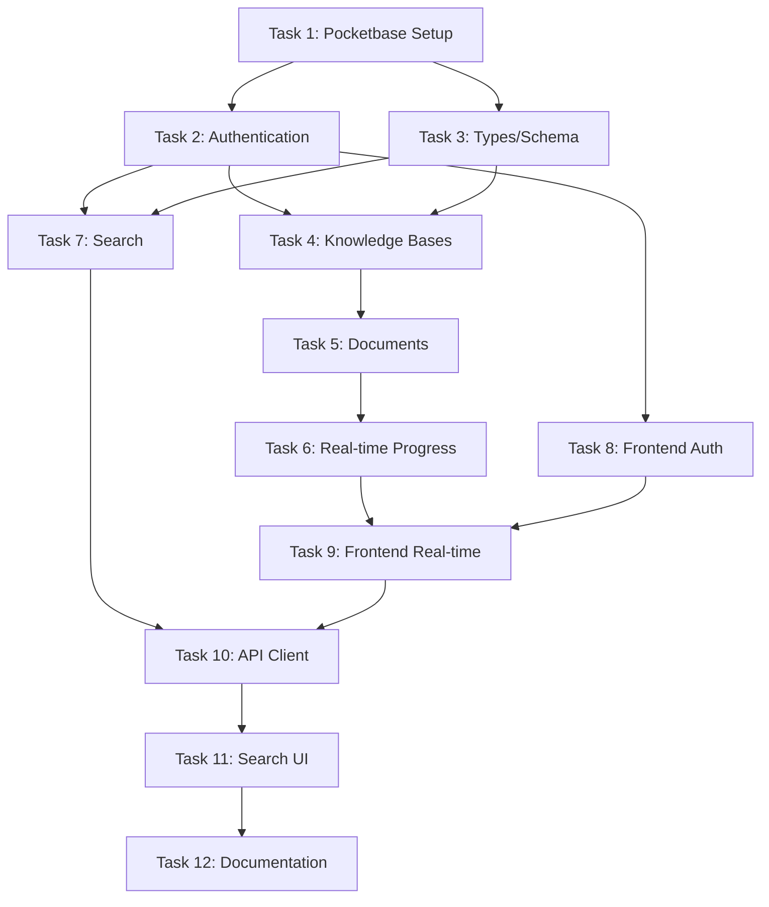

# 🚀 Implementation Plan: Pocketbase + Qdrant + n8n Migration

## 📋 Overview

This document outlines the complete migration from PostgreSQL to a Pocketbase + Qdrant + n8n architecture for the Knowledge Base Management System.

**Pocketbase URL:** `https://pocketbase.visualhive.co/`

## 🏗️ Architecture

```
┌─────────────────┐    ┌─────────────────┐    ┌─────────────────┐
│   React App     │    │   Pocketbase    │    │      n8n        │
│                 │    │                 │    │                 │
│ • Dashboard     │◄──►│ • User Auth     │    │ • File Parsing  │
│ • KB Management │    │ • KB Metadata   │    │ • Chunking      │
│ • File Upload   │    │ • Progress      │    │ • Embedding     │
│ • Search UI     │    │   Tracking      │    │ • Vector Search │
│ • Real-time UI  │    │ • Permissions   │    │                 │
└─────────────────┘    └─────────────────┘    └─────────────────┘
         ▲                       ▲                       ▲
         │                       │                       │
         ▼                       ▼                       ▼
┌─────────────────┐    ┌─────────────────┐    ┌─────────────────┐
│  Express API    │◄───│  WebSocket      │    │     Qdrant      │
│                 │    │  Real-time      │    │                 │
│ • Route Handler │    │  Updates        │    │ • Vector Store  │
│ • Pocketbase    │    │                 │    │ • Document      │
│   Integration   │    │                 │    │   Content       │
│ • n8n Webhooks  │    │                 │    │ • Search Index  │
│ • Progress API  │◄───┴─────────────────┘    │ • Embeddings    │
└─────────────────┘                           └─────────────────┘
         ▲                                             ▲
         │                                             │
         │ ┌─────────────────────────────────────────┐ │
         └─│ n8n calls back: POST /api/progress      │─┘
           │ API updates PB → WebSocket broadcasts   │
           └─────────────────────────────────────────┘
```

## 📊 Database Schema (Pocketbase Collections)

### Users Collection (Built-in)
- `id` (string, auto)
- `email` (email, required, unique)
- `username` (string, required, unique)
- `password` (password, required)
- `verified` (boolean, default: false)

### knowledge_bases Collection
```typescript
interface KnowledgeBase {
  id: string;           // Stable ID for Qdrant filtering
  name: string;         // Display name (can be changed)
  description: string;
  users: string[];      // Relation to users (multiple users can access)
  created: Date;        // Auto
  updated: Date;        // Auto
}
```

### documents Collection
```typescript
interface Document {
  id: string;
  filename: string;
  original_name: string;
  knowledge_base: string;     // Relation to knowledge_bases (inherits user permissions)
  file_type: string;         // 'pdf', 'csv', 'text', 'audio'
  file_size: number;
  processing_status: string; // 'uploading', 'processing', 'chunking', 'embedding', 'completed', 'failed'
  progress_percentage: number;
  chunks_total: number;
  chunks_processed?: number;
  error_message: string;
  qdrant_points: string[];  // JSON array of Qdrant point IDs for cleanup
  created: Date;            // Auto
  updated: Date;            // Auto
}
```

## 🔧 n8n Webhook Endpoints

All endpoints at: `https://n8n-sandbox.visualhive.co/webhook/`

### File Processing Endpoints
- `POST /webhook/parse-file` - Parse uploaded file (PDF, CSV, text, audio)
- `POST /webhook/chunk-content` - Chunk parsed content into segments
- `POST /webhook/embed-chunks` - Create embeddings and store in Qdrant
- `POST /webhook/process-document` - Full pipeline: parse → chunk → embed → store

### Search Endpoints
- `POST /webhook/search-vector` - Vector search in Qdrant
- `POST /webhook/search-hybrid` - Hybrid vector + keyword search

### Cleanup Endpoints
- `POST /webhook/delete-document` - Remove document points from Qdrant
- `POST /webhook/cleanup-orphaned` - Remove orphaned Qdrant points

### Progress Callback Endpoints (n8n calls our API)
- Our API: `POST /api/progress/update` - n8n calls this to update progress

## 🔄 **Data Sync Strategy: Qdrant-Primary with PB Verification**

### Core Principle
**Qdrant is the primary search engine, Pocketbase provides metadata and permissions**

### Document Upload & Processing Flow
```
1. User uploads file
   ↓
2. Create document record in Pocketbase (status: 'uploading')
   ↓
3. Send document ID + file to n8n for processing
   ↓
4. n8n: parse → chunk → embed → store chunks in Qdrant
   ↓
5. n8n calls our API: POST /api/progress/update (with Qdrant point IDs)
   ↓
6. API updates Pocketbase record (status, progress, qdrant_points array)
   ↓
7. WebSocket broadcasts progress to frontend
   ↓
8. Frontend shows real-time updates and completion
```

### Search Flow (Qdrant-Primary)
```
1. User searches via frontend
   ↓
2. Frontend calls our API: POST /api/search
   ↓
3. API calls Qdrant vector search (with optional KB filtering)
   ↓
4. Qdrant returns: chunks + document IDs + similarity scores + KB IDs
   ↓
5. API looks up document metadata in Pocketbase using returned doc IDs
   ↓
6. API filters results by user's KB access permissions
   ↓
7. API returns combined results (Qdrant content + PB metadata)
   ↓
8. Frontend displays search results with metadata and KB context
```

### Sync Maintenance
- **Document Deletion**: Use stored `qdrant_points` array to clean up Qdrant
- **KB Deletion**: Delete all related documents, which triggers Qdrant cleanup
- **Orphaned Data**: Periodic cleanup job removes Qdrant points missing in PB
- **Failed Processing**: Remove PB records if n8n processing fails completely

### Permission Model
- **Knowledge Bases**: `users` field contains array of user IDs with access
- **Documents**: Inherit permissions from parent KB (no separate user field)
- **Search Results**: Filtered by user's accessible KBs before returning

### Why This Approach?
✅ **Vector search primary** - The main value proposition  
✅ **Simple data flow** - One primary search path  
✅ **Built-in verification** - Missing PB records = orphaned Qdrant data  
✅ **Clean permissions** - Filter by KB access  
✅ **Easy to extend** - Can add exact search later

## 📝 Task Implementation Plan

---

## 🎯 **TASK 1: Setup Pocketbase Integration**

### Prompt for Cline:
```
Task: Setup Pocketbase Integration

CONTEXT: 
We're migrating from PostgreSQL to Pocketbase for this knowledge base management system. We need to completely remove PostgreSQL dependencies and set up Pocketbase integration.

REQUIREMENTS:
1. Remove all PostgreSQL/Drizzle dependencies from package.json
2. Add Pocketbase JavaScript SDK
3. Create Pocketbase service layer
4. Setup environment configuration
5. Remove old database files and configurations

SPECIFIC ACTIONS:
1. Remove from package.json: drizzle-orm, drizzle-kit, pg, @types/pg, connect-pg-simple
2. Add to package.json: pocketbase (JavaScript SDK)
3. Delete files: drizzle.config.ts, any migration files
4. Create server/pocketbaseService.ts with connection setup
5. Update .env.example with POCKETBASE_URL
6. Remove DATABASE_URL references
7. Update package.json scripts (remove db:push, db:generate)

POCKETBASE URL: https://pocketbase.visualhive.co/

Create the pocketbaseService.ts with:
- Connection initialization
- Basic CRUD helpers
- Error handling
- Type definitions for collections

CONFIDENCE TARGET: 9/10 - This is foundational setup
```

### Expected Deliverables:
- [ ] PostgreSQL dependencies removed
- [ ] Pocketbase SDK added and configured
- [ ] `server/pocketbaseService.ts` created
- [ ] Environment variables updated
- [ ] Old database files removed

---

## 🎯 **TASK 2: Authentication System**

### Prompt for Cline:
```
Task: Implement Pocketbase Authentication System

CONTEXT:
We need complete user authentication using Pocketbase's built-in auth system. This will handle user registration, login, and JWT token management.

REQUIREMENTS:
1. Create authentication routes in Express
2. Implement JWT middleware for protected routes
3. Handle user registration and login
4. Add password reset functionality
5. Create auth utilities and helpers

SPECIFIC ACTIONS:
1. Create server/auth.ts with Pocketbase auth integration
2. Add authentication middleware to verify JWT tokens
3. Create auth routes: /api/auth/register, /api/auth/login, /api/auth/logout, /api/auth/refresh
4. Update server/routes.ts to include auth routes
5. Add protected route middleware
6. Create shared/authTypes.ts for auth-related type definitions
7. Add error handling for auth failures
8. Implement user context passing to n8n webhooks

AUTHENTICATION FLOW:
1. User registers/logs in via Pocketbase
2. Frontend receives JWT token
3. Token stored in localStorage/httpOnly cookie
4. All API requests include Authorization header
5. Middleware validates token with Pocketbase
6. User info passed to downstream services

CONFIDENCE TARGET: 9/10 - Critical for security
```

### Expected Deliverables:
- [ ] `server/auth.ts` authentication service
- [ ] JWT middleware for protected routes
- [ ] Auth routes implemented
- [ ] Token validation system
- [ ] Error handling for auth failures

---

## 🎯 **TASK 3: Update Shared Types and Remove Old Schema**

### Prompt for Cline:
```
Task: Replace PostgreSQL Schema with Pocketbase Types

CONTEXT:
We need to completely replace the PostgreSQL Drizzle schema with TypeScript interfaces that match our Pocketbase collections.

REQUIREMENTS:
1. Remove existing shared/schema.ts (Drizzle-based)
2. Create new type definitions for Pocketbase collections
3. Add n8n webhook request/response types
4. Create API response types
5. Ensure type safety across frontend and backend

SPECIFIC ACTIONS:
1. Delete existing shared/schema.ts
2. Create shared/types.ts with:
   - User type (matching Pocketbase users)
   - KnowledgeBase type
   - Document type
   - ProcessingJob type
   - API request/response types
   - n8n webhook payload types
3. Create shared/api.ts with API endpoint types
4. Add utility types for status enums
5. Create validation schemas using Zod if needed
6. Update imports across codebase

POCKETBASE COLLECTIONS TO TYPE:
- users (built-in Pocketbase collection)
- knowledge_bases 
- documents
- processing_jobs

n8N WEBHOOK PAYLOAD STRUCTURE:
All payloads should include:
- user_token: string
- knowledge_base_id?: string  
- operation: string
- data: any

CONFIDENCE TARGET: 8/10 - Foundation for type safety
```

### Expected Deliverables:
- [ ] Old PostgreSQL schema removed
- [ ] New `shared/types.ts` with Pocketbase types
- [ ] n8n webhook types defined
- [ ] API response types created
- [ ] Type imports updated across codebase

---

## 🎯 **TASK 4: Knowledge Base Management System**

### Prompt for Cline:
```
Task: Implement Knowledge Base CRUD with Pocketbase

CONTEXT:
Create complete knowledge base management system using Pocketbase, maintaining stable IDs for Qdrant filtering while allowing name changes. Knowledge bases have a users array for multi-user access.

REQUIREMENTS:
1. Implement KB CRUD operations in Pocketbase
2. Create API routes for KB management  
3. Handle multi-user access control via users array
4. Maintain stable IDs for Qdrant tagging
5. No direct n8n integration needed (n8n only processes files)

SPECIFIC ACTIONS:
1. Create server/knowledgeBaseService.ts with:
   - createKnowledgeBase()
   - updateKnowledgeBase() 
   - deleteKnowledgeBase()
   - getUserKnowledgeBases()
   - getKnowledgeBaseById()
   - addUserToKB()
   - removeUserFromKB()
2. Add KB routes to server/routes.ts:
   - POST /api/kb (create)
   - PUT /api/kb/:id (update)
   - DELETE /api/kb/:id (delete)
   - GET /api/kb (list user's accessible KBs)
   - GET /api/kb/:id (get specific KB)
   - POST /api/kb/:id/users (add user to KB)
   - DELETE /api/kb/:id/users/:userId (remove user from KB)
3. Implement permission checking:
   - User can only access KBs where they're in the users array
   - KB operations require user to be in the users array
   - When deleting KB, also delete all related documents
4. Add proper error handling and validation

PERMISSION MODEL:
- Knowledge bases have users array field (relation to multiple users)
- Documents inherit permissions from parent KB (no separate user field)  
- User can access KB if their ID is in the KB's users array
- When creating KB, add creating user to users array automatically

QDRANT INTEGRATION:
- Store stable KB ID for Qdrant filtering (kb.id)
- When KB deleted, delete all related documents (which triggers Qdrant cleanup)
- No direct n8n calls needed at KB level

CONFIDENCE TARGET: 9/10 - Core functionality with simpler scope
```

### Expected Deliverables:
- [ ] `server/knowledgeBaseService.ts` service layer
- [ ] KB CRUD API routes implemented
- [ ] n8n webhook integration for KB operations
- [ ] User-scoped access control
- [ ] Stable ID management for Qdrant

---

## 🎯 **TASK 5: Document Management System**

### Prompt for Cline:
```
Task: Implement Document Management with File Upload

CONTEXT:
Create document management system that handles file uploads, triggers n8n processing, and tracks progress via n8n callbacks to our API. Documents inherit permissions from their parent KB.

REQUIREMENTS:
1. Handle file uploads (PDF, CSV, text, audio)
2. Create document records in Pocketbase (no separate user field)
3. Trigger n8n processing workflows
4. Handle progress updates from n8n callbacks
5. Manage Qdrant point IDs for cleanup

SPECIFIC ACTIONS:
1. Create server/documentService.ts with:
   - uploadDocument()
   - updateDocument()
   - deleteDocument() (includes Qdrant cleanup)
   - getDocuments()
   - updateProcessingProgress()
2. Add file upload middleware (multer or similar)
3. Create document API routes:
   - POST /api/documents/upload
   - PUT /api/documents/:id
   - DELETE /api/documents/:id (clean up Qdrant using stored point IDs)
   - GET /api/documents/kb/:kbId
   - GET /api/documents/:id
   - POST /api/progress/update (callback from n8n)
4. Implement permission checking:
   - User can only access documents in KBs they have access to
   - Check KB permissions before document operations
5. Handle file cleanup on errors

FILE UPLOAD FLOW:
1. User uploads file → Save to temp storage
2. Create document record in Pocketbase (with KB relation, inherit permissions)
3. Call n8n process-document webhook (send PB document ID + file)
4. n8n processes: parse → chunk → embed → store in Qdrant
5. n8n calls our API: POST /api/progress/update (with progress + point IDs)
6. Update document status and qdrant_points array in Pocketbase
7. WebSocket broadcasts updates to frontend

n8n PAYLOAD TO US:
POST /api/progress/update
{
  "document_id": "pocketbase_document_id",
  "progress": 75,
  "status": "embedding",
  "chunks_total": 100,
  "chunks_processed": 75,
  "qdrant_points": ["point_id_1", "point_id_2", ...],
  "error_message": null
}

n8n PAYLOAD FROM US:
POST /webhook/process-document
{
  "document_id": "pocketbase_document_id", 
  "knowledge_base_id": "stable_kb_id",
  "file_data": "base64_or_url",
  "file_type": "pdf|csv|text|audio",
  "metadata": {
    "filename": "doc.pdf",
    "user_id": "user_123"
  }
}

QDRANT CLEANUP:
- Store point IDs in document.qdrant_points array
- When deleting document, use stored IDs to clean up Qdrant
- Handle orphaned data with periodic cleanup jobs

CONFIDENCE TARGET: 9/10 - Critical user workflow with cleaner architecture
```

### Expected Deliverables:
- [ ] `server/documentService.ts` service layer
- [ ] File upload handling with multer
- [ ] Document CRUD API routes
- [ ] n8n webhook integration for processing
- [ ] Progress tracking system

---

## 🎯 **TASK 6: Real-time Progress Tracking**

### Prompt for Cline:
```
Task: Implement Real-time Progress Updates

CONTEXT:
Create real-time progress tracking for document processing using Pocketbase real-time subscriptions and WebSockets.

REQUIREMENTS:
1. Setup Pocketbase real-time subscriptions
2. Create WebSocket endpoints for frontend
3. Handle progress updates from n8n
4. Update processing job records
5. Broadcast progress to connected clients

SPECIFIC ACTIONS:
1. Create server/progressService.ts with:
   - createProcessingJob()
   - updateProgress()
   - completeJob()
   - failJob()
   - subscribeToProgress()
2. Add WebSocket support to Express server
3. Create progress API routes:
   - POST /api/progress/start
   - PUT /api/progress/:jobId
   - GET /api/progress/:jobId
   - WebSocket /ws/progress/:jobId
4. Setup Pocketbase real-time listeners
5. Integrate with n8n progress callbacks
6. Add error handling and cleanup

REAL-TIME FLOW:
1. Document upload starts → Create processing job
2. Frontend subscribes to job progress via WebSocket
3. n8n calls progress-update webhook → Update job in Pocketbase
4. Pocketbase real-time triggers → Broadcast to WebSocket clients
5. Frontend updates progress bars in real-time

PROGRESS WEBHOOK FROM n8n:
POST /api/progress/update
{
  "job_id": "processing_job_id",
  "progress": 45,
  "current_step": "chunking",
  "total_chunks": 100,
  "processed_chunks": 45,
  "status": "processing"
}

CONFIDENCE TARGET: 8/10 - Complex real-time feature
```

### Expected Deliverables:
- [ ] `server/progressService.ts` progress tracking
- [ ] WebSocket integration for real-time updates
- [ ] Progress API routes
- [ ] Pocketbase real-time subscriptions
- [ ] n8n progress webhook handlers

---

## 🎯 **TASK 7: Search Integration**

### Prompt for Cline:
```
Task: Implement Qdrant-Primary Vector Search Integration

CONTEXT:
Create search functionality that uses Qdrant as the primary search engine, then verifies and enriches results with Pocketbase metadata and permissions.

REQUIREMENTS:
1. Implement Qdrant-primary search flow
2. Integrate with n8n vector search endpoints
3. Verify results with Pocketbase metadata
4. Filter results by user KB permissions
5. Handle both global and KB-specific searches

SPECIFIC ACTIONS:
1. Create server/searchService.ts with:
   - searchVector() (primary search function)
   - searchGlobal() (search across all user's KBs)
   - searchInKnowledgeBase() (search within specific KB)
   - verifyDocumentAccess() (check PB permissions)
   - enrichWithMetadata() (add PB metadata to results)
2. Add search API routes:
   - POST /api/search/global
   - POST /api/search/kb/:kbId  
   - GET /api/search/history (optional)
3. Implement Qdrant-primary search flow:
   - Call n8n vector search
   - Get document IDs from Qdrant results
   - Look up documents in Pocketbase
   - Filter by user's KB access permissions
   - Enrich results with metadata
4. Handle search result processing and ranking
5. Add error handling for missing documents (orphaned Qdrant data)

QDRANT-PRIMARY SEARCH FLOW:
1. User searches → Call n8n vector search
2. Qdrant returns: chunks + document IDs + KB IDs + similarity scores
3. Look up documents in Pocketbase using returned doc IDs
4. Filter results: only include docs from KBs user has access to
5. Enrich results with PB metadata (filename, type, etc.)
6. Return combined results (Qdrant content + PB metadata)

SEARCH REQUEST TO n8n:
POST /webhook/search-vector
{
  "query": "search text",
  "knowledge_base_id": "optional_kb_id_for_filtering",
  "limit": 20,
  "similarity_threshold": 0.7
}

SEARCH RESPONSE FROM n8n:
{
  "results": [
    {
      "content": "matching text chunk",
      "score": 0.95,
      "document_id": "pocketbase_document_id",
      "knowledge_base_id": "stable_kb_id", 
      "chunk_index": 5,
      "qdrant_point_id": "point_123"
    }
  ],
  "total_results": 15
}

PERMISSION FILTERING:
- Get user's accessible KB IDs from Pocketbase
- Filter Qdrant results to only include accessible KBs
- Remove results for documents that don't exist in PB (orphaned data)
- Log orphaned data for cleanup

RESULT ENRICHMENT:
- Add document metadata from Pocketbase (filename, type, upload date)
- Add KB name and description  
- Calculate result ranking (similarity score + metadata relevance)
- Format for frontend consumption

CONFIDENCE TARGET: 8/10 - Complex search integration with clear data flow
```

### Expected Deliverables:
- [ ] `server/searchService.ts` search integration
- [ ] Search API routes (global and KB-specific)
- [ ] n8n webhook integration for search
- [ ] Search result formatting
- [ ] Search history tracking

---

## 🎯 **TASK 8: Frontend Authentication Integration**

### Prompt for Cline:
```
Task: Update Frontend for Pocketbase Authentication

CONTEXT:
Update the React frontend to use Pocketbase authentication, handle JWT tokens, and manage user sessions.

REQUIREMENTS:
1. Create authentication context and hooks
2. Add login/register forms
3. Implement protected routes
4. Handle token storage and refresh
5. Update API client for auth headers

SPECIFIC ACTIONS:
1. Create client/src/contexts/AuthContext.tsx with:
   - User state management
   - Login/logout functions
   - Token handling
   - Protected route logic
2. Create client/src/components/auth/ folder with:
   - LoginForm.tsx
   - RegisterForm.tsx
   - ProtectedRoute.tsx
3. Update client/src/lib/api.ts to:
   - Include auth headers
   - Handle 401 responses
   - Automatic token refresh
4. Create client/src/hooks/useAuth.ts
5. Add auth pages:
   - client/src/pages/LoginPage.tsx
   - client/src/pages/RegisterPage.tsx
6. Update App.tsx for auth routing
7. Add logout functionality

AUTHENTICATION FLOW:
1. User visits protected route → Redirect to login
2. User logs in → Store JWT token
3. All API calls include Authorization header
4. Token expires → Automatic refresh or re-login
5. User logs out → Clear token and redirect

TOKEN STORAGE:
- Use httpOnly cookies for production security
- Fallback to localStorage for development
- Handle token expiration gracefully

CONFIDENCE TARGET: 8/10 - Critical user experience
```

### Expected Deliverables:
- [ ] `AuthContext` and auth hooks
- [ ] Login/Register forms
- [ ] Protected route components
- [ ] API client auth integration
- [ ] Auth pages and routing

---

## 🎯 **TASK 9: Frontend Real-time Updates**

### Prompt for Cline:
```
Task: Add Real-time Progress to Frontend

CONTEXT:
Add real-time progress bars and status updates to the frontend using WebSocket connections to the backend.

REQUIREMENTS:
1. Create WebSocket hooks for real-time updates
2. Add progress bars to file upload flow
3. Show real-time processing status
4. Handle connection errors gracefully
5. Update existing components for real-time data

SPECIFIC ACTIONS:
1. Create client/src/hooks/useWebSocket.ts
2. Create client/src/hooks/useProgress.ts for progress tracking
3. Update client/src/components/AddDocumentModal.tsx:
   - Add real-time progress bar
   - Show processing steps
   - Handle upload states
4. Create client/src/components/ProgressBar.tsx
5. Update document list to show real-time status
6. Add loading states and error handling
7. Create notification system for completed uploads

REAL-TIME FEATURES:
- Progress bars during file processing
- Status updates (parsing, chunking, embedding)
- Error notifications
- Completion notifications
- Connection status indicators

WEBSOCKET INTEGRATION:
1. Connect to WebSocket on document upload
2. Subscribe to progress updates
3. Update UI in real-time
4. Cleanup connections on unmount
5. Handle reconnection on connection loss

ERROR HANDLING:
- Show friendly error messages
- Retry failed operations
- Graceful degradation without WebSocket
- Contact admin messages for persistent failures

CONFIDENCE TARGET: 7/10 - Complex real-time UI
```

### Expected Deliverables:
- [ ] WebSocket hooks for real-time updates
- [ ] Progress bars in upload modal
- [ ] Real-time status indicators
- [ ] Error handling and notifications
- [ ] Connection management

---

## 🎯 **TASK 10: API Client Updates and Error Handling**

### Prompt for Cline:
```
Task: Update Frontend API Client and Error Handling

CONTEXT:
Update the frontend API client to work with the new Pocketbase backend, handle authentication, and provide robust error handling.

REQUIREMENTS:
1. Update API client for new backend endpoints
2. Add comprehensive error handling
3. Implement retry logic for failed requests
4. Add loading states management
5. Create user-friendly error messages

SPECIFIC ACTIONS:
1. Update client/src/lib/api.ts:
   - New endpoint URLs
   - Auth header management
   - Error response handling
   - Retry logic for network failures
2. Create client/src/lib/errors.ts:
   - Error type definitions
   - User-friendly error messages
   - Error reporting utilities
3. Update all API calls in components:
   - Knowledge base operations
   - Document operations
   - Search operations
   - User operations
4. Add global error boundary
5. Create toast notifications for errors
6. Add network status detection

API CLIENT FEATURES:
- Automatic auth header injection
- Request/response interceptors
- Retry logic with exponential backoff
- Network error detection
- User-friendly error messages
- Loading state management

ERROR HANDLING STRATEGY:
- Network errors → "Please check your connection"
- Auth errors → Redirect to login
- Server errors → "Please try again or contact admin"
- Validation errors → Show specific field errors
- Rate limiting → Show retry countdown

CONFIDENCE TARGET: 8/10 - Critical for user experience
```

### Expected Deliverables:
- [ ] Updated API client with auth support
- [ ] Comprehensive error handling
- [ ] Retry logic for network failures
- [ ] User-friendly error messages
- [ ] Global error boundary

---

## 🎯 **TASK 11: Search UI Enhancement**

### Prompt for Cline:
```
Task: Enhance Search UI for Vector Search

CONTEXT:
Update the search interface to work with vector search results from Qdrant, showing relevance scores and knowledge base context.

REQUIREMENTS:
1. Update search components for vector search
2. Display relevance scores and metadata
3. Add knowledge base filtering
4. Show search result highlighting
5. Implement search history

SPECIFIC ACTIONS:
1. Update client/src/components/SearchBar.tsx:
   - Global vs KB-specific search toggle
   - Search suggestions
   - Recent searches dropdown
2. Create client/src/components/SearchResults.tsx:
   - Vector search result display
   - Relevance score indicators
   - Knowledge base tags
   - Content highlighting
3. Update search pages:
   - Global search page
   - KB-specific search
   - Advanced search filters
4. Add search analytics:
   - Search history
   - Popular searches
   - Search performance metrics
5. Create search result actions:
   - Open document
   - Save search
   - Share results

SEARCH RESULT DISPLAY:
- Relevance score (0-100%)
- Content snippet with highlighting
- Source document name
- Knowledge base name and color
- Date/time metadata
- Action buttons (open, save, share)

SEARCH FEATURES:
- Instant search suggestions
- Search history dropdown
- Filter by knowledge base
- Sort by relevance/date
- Export search results
- Save searches for later

CONFIDENCE TARGET: 7/10 - Complex search UI
```

### Expected Deliverables:
- [ ] Enhanced search components
- [ ] Vector search result display
- [ ] Knowledge base filtering
- [ ] Search history functionality
- [ ] Search result actions

---

## 🎯 **TASK 12: Environment Configuration and Documentation**

### Prompt for Cline:
```
Task: Finalize Configuration and Documentation

CONTEXT:
Complete the environment setup, update documentation, and ensure the application is ready for deployment.

REQUIREMENTS:
1. Update environment configuration
2. Create comprehensive README
3. Add deployment instructions
4. Create troubleshooting guide
5. Add API documentation

SPECIFIC ACTIONS:
1. Update .env.example with all required variables:
   - POCKETBASE_URL
   - N8N_WEBHOOK_BASE_URL
   - JWT_SECRET (if needed)
   - NODE_ENV
   - PORT
2. Update README.md:
   - New architecture overview
   - Installation instructions
   - Pocketbase setup
   - n8n webhook requirements
   - Development workflow
3. Create DEPLOYMENT.md:
   - Production deployment steps
   - Environment variables
   - Health checks
   - Monitoring setup
4. Create API_DOCUMENTATION.md:
   - All API endpoints
   - Request/response examples
   - Authentication requirements
   - Error codes
5. Update package.json scripts:
   - Remove old database scripts
   - Add new development commands
   - Add production build steps

ENVIRONMENT VARIABLES:
```env
# Pocketbase Configuration
POCKETBASE_URL=https://pocketbase.visualhive.co/

# n8n Configuration  
N8N_WEBHOOK_BASE_URL=https://n8n-sandbox.visualhive.co/webhook/

# Server Configuration
PORT=5000
NODE_ENV=development

# Optional: Additional security
JWT_SECRET=your-jwt-secret-if-needed
CORS_ORIGINS=http://localhost:3000,https://yourdomain.com
```

CONFIDENCE TARGET: 9/10 - Documentation is critical
```

### Expected Deliverables:
- [ ] Updated environment configuration
- [ ] Comprehensive README.md
- [ ] Deployment documentation
- [ ] API documentation
- [ ] Updated package.json scripts

---

## 🔄 **Task Dependencies**



## 🚀 **Execution Strategy**

### Phase 1: Backend Foundation (Tasks 1-3)
- **Duration**: 1-2 days
- **Focus**: Remove PostgreSQL, setup Pocketbase, authentication
- **Blocker Risk**: Low - Independent tasks

### Phase 2: Core Backend Features (Tasks 4-7)  
- **Duration**: 2-3 days
- **Focus**: Knowledge bases, documents, progress, search
- **Blocker Risk**: Medium - Depends on n8n webhook availability

### Phase 3: Frontend Integration (Tasks 8-11)
- **Duration**: 2-3 days  
- **Focus**: Auth UI, real-time features, API integration
- **Blocker Risk**: Low - Can work with mock data initially

### Phase 4: Polish and Deploy (Task 12)
- **Duration**: 1 day
- **Focus**: Documentation, configuration, deployment prep
- **Blocker Risk**: Low - Final cleanup

## 🧪 **Testing Strategy**

### Manual Testing Checklist:
- [ ] User registration and login
- [ ] Knowledge base CRUD operations
- [ ] File upload with progress tracking
- [ ] Real-time progress updates
- [ ] Vector search functionality
- [ ] Error handling scenarios
- [ ] Authentication edge cases

### Integration Testing:
- [ ] Pocketbase connectivity
- [ ] n8n webhook calls
- [ ] Real-time WebSocket connections
- [ ] File upload and processing flow
- [ ] Search integration

## 🐛 **Common Issues and Solutions**

### Pocketbase Connection Issues:
```bash
# Check Pocketbase health
curl https://pocketbase.visualhive.co/api/health

# Verify authentication
curl -H "Authorization: Bearer $TOKEN" https://pocketbase.visualhive.co/api/collections
```

### n8n Webhook Issues:
```bash
# Test webhook availability
curl -X POST https://n8n-sandbox.visualhive.co/webhook/test

# Check webhook response format
curl -X POST -H "Content-Type: application/json" \
  -d '{"test": "data"}' \
  https://n8n-sandbox.visualhive.co/webhook/kb-create
```

### CORS Issues:
- Ensure Pocketbase CORS settings allow your domain
- Check n8n webhook CORS configuration
- Verify Express CORS middleware setup

## 📞 **Support Contacts**

- **Pocketbase Issues**: Check https://pocketbase.visualhive.co/
- **n8n Webhook Issues**: Test endpoints at https://n8n-sandbox.visualhive.co/
- **General Questions**: Refer to this implementation plan

---

**Ready to start implementation? Begin with Task 1 and work through each task systematically. Each task includes specific prompts designed for Cline to execute efficiently.**